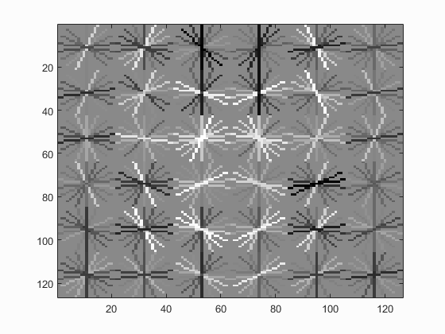
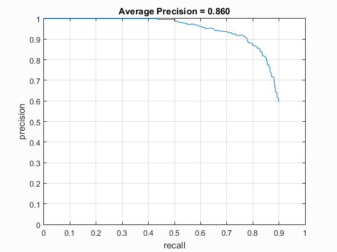
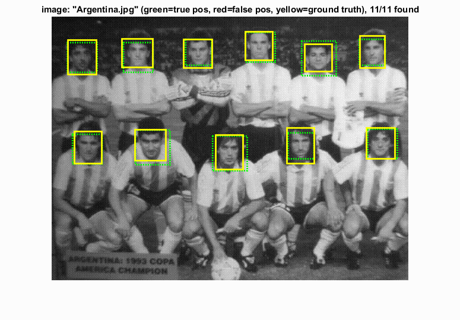
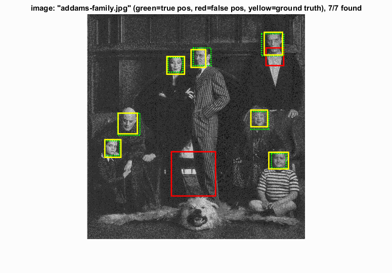
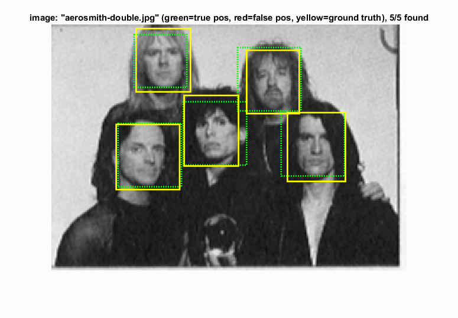
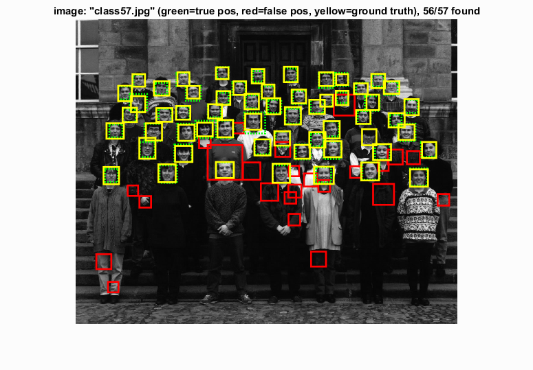
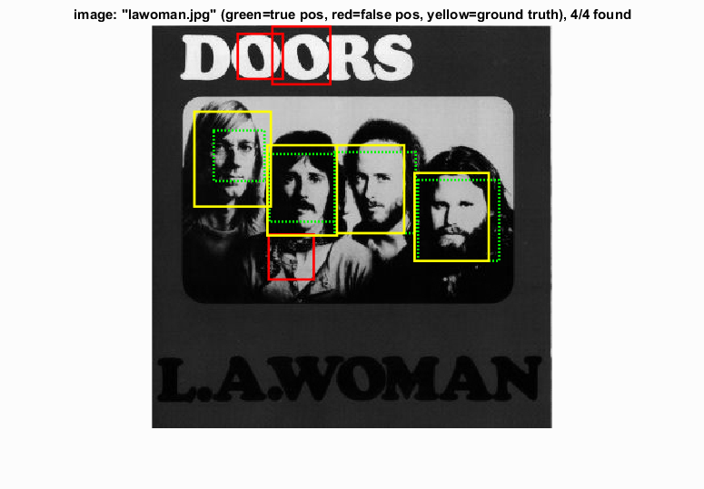
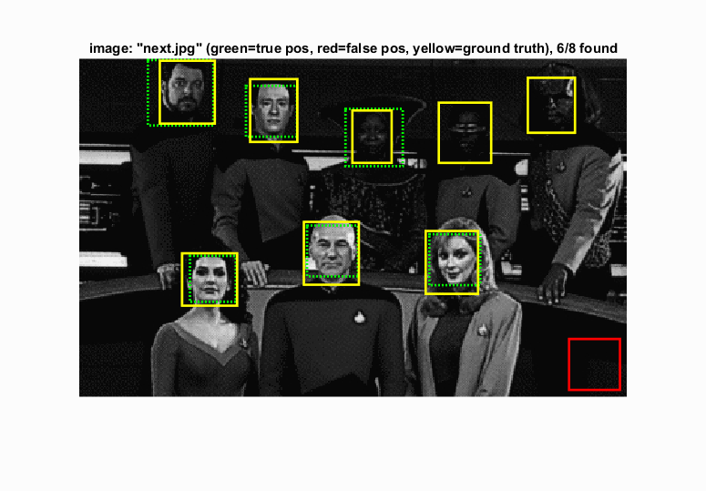

# Fu-En Wang(102061149)

#Project 4 / Face Detection with a Sliding Window
# Open Source repo
[https://github.com/fuenwang/CV_hw4](https://github.com/fuenwang/CV_hw4)
## Overview
In this project we will implement human face detection system by template match method.

## Background Knowledge
### HOG(Histogram of Oriented Gradient)
HoG is a kind of feature just like SIFT, but HoG is more commonly used in human topic(like face detection and  pedestrian detection)<br>
Because HoG is operated in small patch, it is considered that HoG is robust to geometry and light.
### Down Scale sample
Because template match is to use a certain size of patch to detect feature, so the scale of image is strictly important.<br>
As a result, for each image we should resize it to several scales to find the best size to fit our template size.
<p align="center"></p>

## Implementation
### Set Parameter
In the beginning, we should choose the template size and hog cell size first, which will affect our average precision.
### Collect Features
For positive examples, we collect all the hog feature of them.
```
image_files = dir( fullfile( train_path_pos, '*.jpg') ); %Caltech Faces stored as .jpg
cell_size = feature_params.hog_cell_size;
L = (feature_params.template_size / feature_params.hog_cell_size)^2 * 31;
%error('GG')
%[train_path_pos '\' image_files(1).name]
%error('GG');
num_images = length(image_files);
features_pos = [];
for i=1:num_images
    image_path = [train_path_pos '\' image_files(i).name];
    img = imread(image_path);
    hog = vl_hog(im2single(img), cell_size);
    features_pos(end+1,:) = reshape(hog, 1, L);
end
```
For negative examples, I random sample 30000 hog features between them.
```
    image_files = dir( fullfile( non_face_scn_path, '*.jpg' ));
    num_images = length(image_files);
    temp_size = feature_params.template_size;
    cell_size = feature_params.hog_cell_size;
    L = (feature_params.template_size / feature_params.hog_cell_size)^2 * 31;
    num_per_image = round(num_samples / num_images);
    features_neg = zeros(num_per_image*num_images, L);
    index = 1;
    for i = 1:num_images
        i
        img = im2single(rgb2gray(imread([non_face_scn_path '\' image_files(i).name])));
        [height, width] = size(img);
        if height >= temp_size+2 && width >= temp_size+2
            row_range = 1:(height-temp_size+1);
            col_range = 1:(width-temp_size+1);
            for j = 1:num_per_image
                row = randsample(row_range, 1);
                col = randsample(col_range, 1);
                crop = img(row:row+temp_size-1, col:col+temp_size-1);
                features_neg(index,:) = reshape(vl_hog(crop, cell_size), 1, L);
                index = index + 1;
            end
        end
    end
```
### Train Classifier
Use vl_svmtrain to get the weight of our classifier.
```
train_data = vertcat(features_pos, features_neg);
label = zeros(1, size(train_data, 1));
label(1:size(features_pos,1)) = 1;
label(size(features_pos,1)+1:end) = -1;
[w b] = vl_svmtrain(train_data', label, 0.001);
```
### Bounding box detection
Use our weight parameters to detect face of image. For each image, we can down-scale it to fit face area fit our template size.
```
test_scenes = dir( fullfile( test_scn_path, '*.jpg' ));
bboxes = zeros(0,4);
confidences = zeros(0,1);
image_ids = cell(0,1);
scale_factor = [1, 0.9, 0.8, 0.7, 0.6, 0.5, 0.4, 0.3, 0.2, 0.1, 0.05];
scale_num = length(scale_factor);
cell_size = feature_params.hog_cell_size;
temp_size = feature_params.template_size;
jump = temp_size / cell_size;
L = (feature_params.template_size / feature_params.hog_cell_size)^2 * 31;
for i = 1:length(test_scenes)
    fprintf('Detecting faces in %s\n', test_scenes(i).name)
    img = imread( fullfile( test_scn_path, test_scenes(i).name ));
    img = single(img)/255;
    if(size(img,3) > 1)
        img = rgb2gray(img);
    end
    cur_bboxes = zeros(0, 4);
    cur_confidences = zeros(0, 0);
    cur_image_ids = {};
    for scale = scale_factor
        %scale
        img_scale = imresize(img, scale);
        [height, width] = size(img_scale);
        img_hog = vl_hog(img_scale, cell_size);
        num_of_cell_row = size(img_hog, 1);
        num_of_cell_col = size(img_hog, 2);
        %num_of_window_row = floor(num_of_cell_row / (jump));
        %num_of_window_col = floor(num_of_cell_col / (jump));
        num_of_window_row = num_of_cell_row - jump + 1;
        num_of_window_col = num_of_cell_col - jump + 1;
        features = zeros(num_of_window_row* num_of_window_col, L);
        index = 1;
        row_map = zeros(1, num_of_window_row* num_of_window_col);
        col_map = zeros(1, num_of_window_row* num_of_window_col);
        for start_row = 1:num_of_window_row
            for start_col = 1:num_of_window_col
                end_row = start_row + jump - 1;
                end_col = start_col + jump - 1;
                patch = img_hog(start_row:end_row, start_col:end_col, :);
                %L
                %size(patch)
                features(index, :) = reshape(patch, 1, L);
                row_map(index) = (start_row-1) * jump + 1;
                col_map(index) = (start_col-1) * jump + 1;
                index = index + 1;
                %error('GG');
            end
        end
        index_vec = 1:(num_of_window_row*num_of_window_col);
        score_vec = features * w + b;
        binary = score_vec' > 0.9;
        %binary = score_vec' == score_vec';
        indice = index_vec(binary);
        scale_cur_y_min = row_map(indice)';
        scale_cur_x_min = col_map(indice)';
        %fprintf('H:%d      %d\n', height, scale_cur_y_min)
        %fprintf('W:%d      %d\n', width, scale_cur_x_min)
        scale_cur_y_max = scale_cur_y_min + temp_size - 1;
        scale_cur_x_max = scale_cur_x_min + temp_size - 1;
        scale_cur_bboxes = [scale_cur_x_min, scale_cur_y_min, scale_cur_x_max, scale_cur_y_max] / scale;
        scale_cur_confidences = score_vec(indice)';
        size(scale_cur_bboxes, 1);
        cur_image_ids = vertcat(cur_image_ids, repmat({test_scenes(i).name}, size(scale_cur_bboxes, 1), 1));
        cur_bboxes = vertcat(cur_bboxes, scale_cur_bboxes);
        cur_confidences = vertcat(cur_confidences, scale_cur_confidences');
        %cur_bboxes(end+1, :) = scale_cur_bboxes;
        %cur_confidences(end+1, :) = scale_cur_confidences;
        %error('gg')
    end
    [is_maximum] = non_max_supr_bbox(cur_bboxes, cur_confidences, size(img));   
    cur_confidences = cur_confidences(is_maximum,:);
    cur_bboxes      = cur_bboxes(     is_maximum,:);
    cur_image_ids   = cur_image_ids(  is_maximum,:);
    bboxes      = [bboxes;      cur_bboxes];
    confidences = [confidences; cur_confidences];
    image_ids   = [image_ids;   cur_image_ids];
end
```

### Results
<center>
<p>
Hog detecter
<p>

<p>
Precision Recall curve for the starter code.
<p>

<p>
Example of detection on the test set from the starter code.







</center>
